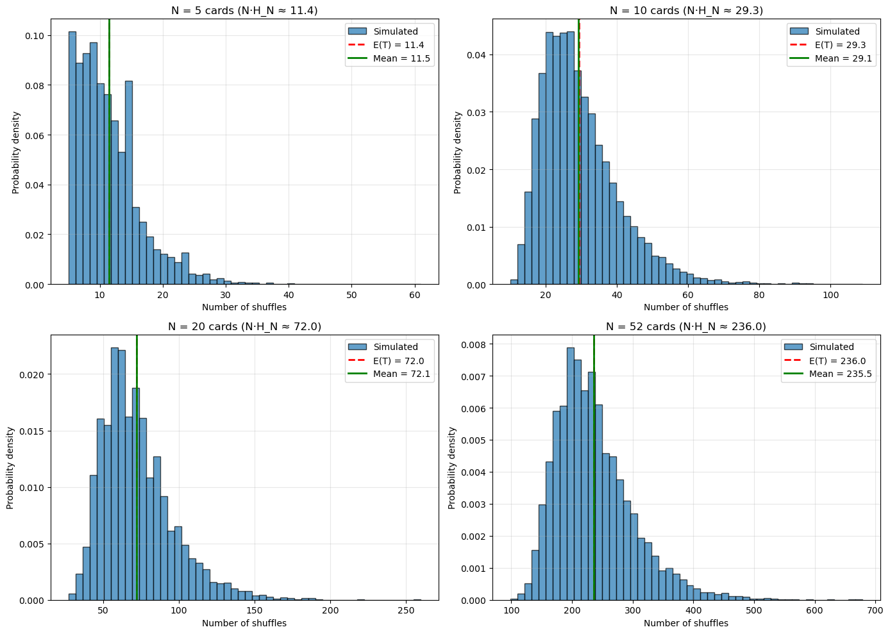
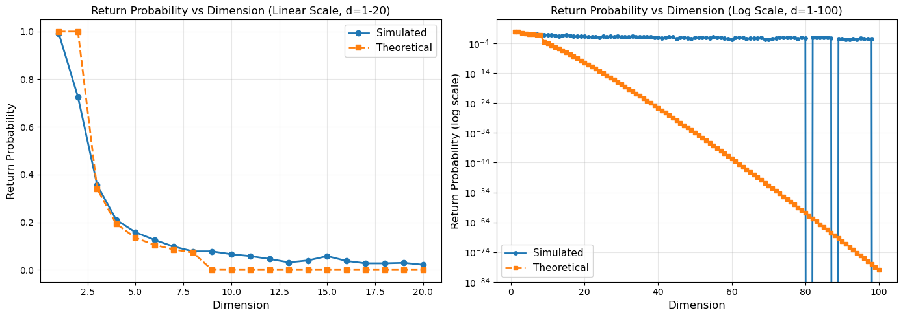
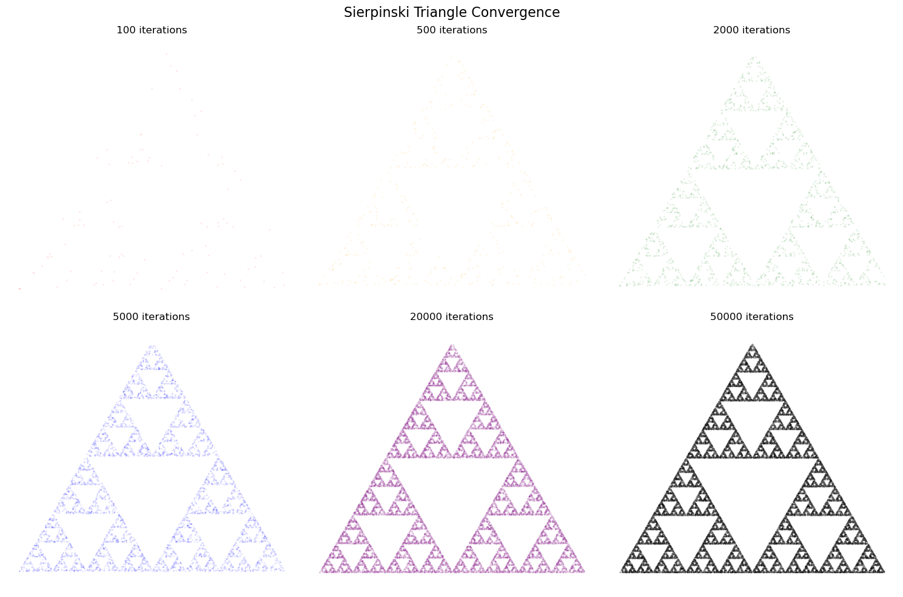
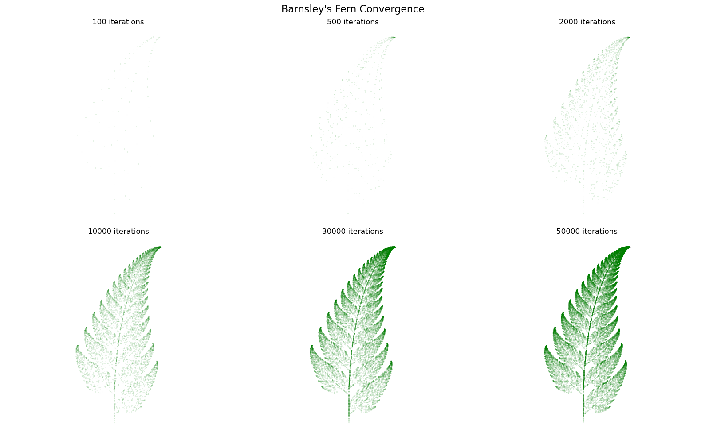
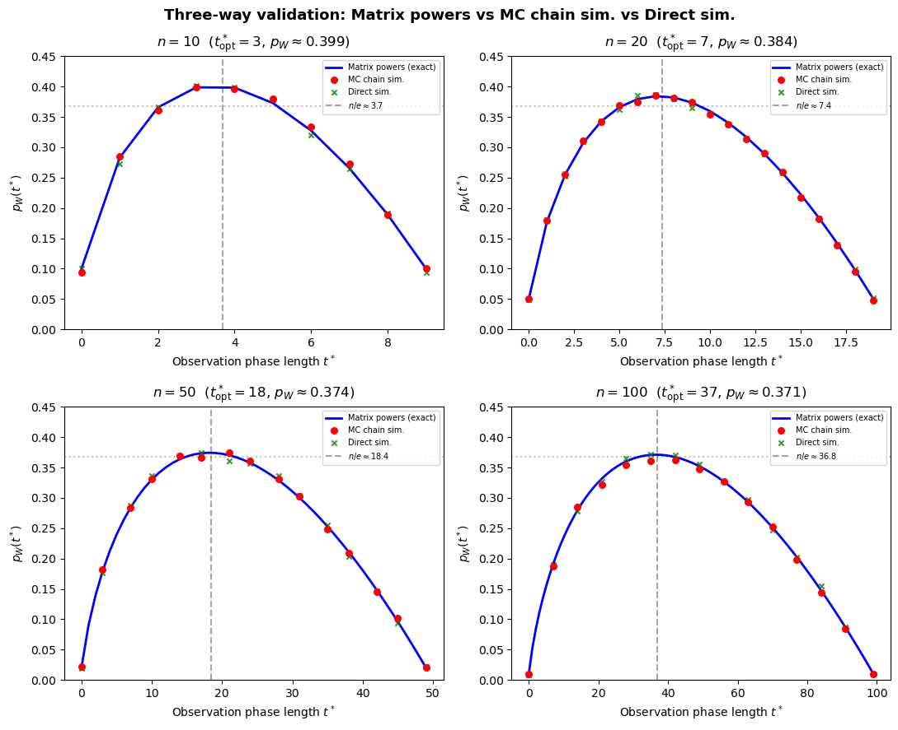

# Markov Processes

Simulations and write-ups from **1MS012 Markov Processes** (period 3, year 1) of the M.Sc. in Image Analysis and Machine Learning at Uppsala University.

Each notebook takes a result from the course — mixing time, Pólya recurrence, stationary distributions, the secretary problem — and checks it the way I find most convincing: simulate it, then put the empirical numbers next to the theory and see how close they land. The code is a mix of Python ports of the course's MATLAB examples and independent experiments I wrote while working through the material.

## What's in here

```
markovprocesses/
├── assignments/
│   └── a1/                             # first written assignment (PDF)
├── notebooks/
│   ├── card_shuffling.ipynb            # mixing time for a top-to-random shuffle
│   ├── random_walks_recurrence.ipynb   # Pólya recurrence of random walks in d dimensions
│   ├── markov_chain_and_ifs.ipynb      # 3-state chain simulator + Sierpinski & Barnsley IFS
│   └── stationary_distributions.ipynb  # stationary distributions via the null space of (P − I)ᵀ
└── project/
    ├── Simulation.ipynb                # group project: secretary problem as a Markov chain
    └── exec_nb.py                       # runs Simulation.ipynb end-to-end and reports cell counts
```

## How to run

The notebooks only need the scientific-Python basics:

```bash
pip install numpy matplotlib jupyter nbformat nbconvert
jupyter lab        # then open any notebook under notebooks/ or project/
```

Each notebook runs top to bottom with no extra data files. To re-execute the project notebook headlessly:

```bash
cd project
python exec_nb.py   # executes Simulation.ipynb and prints the per-cell execution counts
```

## Notebooks

**`card_shuffling.ipynb`** — top-to-random shuffle: take the top card and reinsert it at a uniformly random position. The deck is mixed once the original bottom card resurfaces, and that time has expectation E(T) = N·H_N (N times the N-th harmonic number), so it grows like N·log N. Simulating 10,000 decks per size matches the closed form tightly — for a 52-card deck the simulated mean was 235.47 against the theoretical 235.98. The notebook also breaks T into its geometric components and plots the distributions.


*Shuffles needed to mix, for decks of 5 to 52 cards — the simulated mean (green) lands on the theoretical expectation N·H(N) (red dashed); 235.5 vs 236.0 for a full deck.*

**`random_walks_recurrence.ipynb`** — symmetric random walks on ℤ^d for d = 1…100, estimating the return probability to the origin (10,000 steps × 1,000 trials per dimension) and comparing it with Pólya's theorem: recurrent for d ≤ 2, transient for d ≥ 3. In d = 3 the simulated return probability was 0.339 against the known 0.3405, and across all 100 dimensions the mean absolute error versus theory was 0.016. Includes 1D/2D/3D path visualisations.


*Return probability versus dimension. Recurrent for d ≤ 2, transient for d ≥ 3; on the log scale the simulated estimate floors out once the true probability falls below what the finite trial count can resolve.*

**`markov_chain_and_ifs.ipynb`** — three short simulations:
1. A 3-state Markov chain simulator (Python port of the course's MATLAB code). For the doubly-stochastic example matrix the visited-state frequencies (≈0.34 / 0.39 / 0.28 over 79 steps) sit around the uniform stationary distribution of 1/3 each.
2. The Sierpinski triangle from the chaos game — an IFS of three equally-weighted affine maps, 50,000 points.
3. Barnsley's fern from a weighted IFS of four affine maps.


*The Sierpinski triangle emerging from the chaos game, from 100 to 50,000 points.*


*Barnsley's fern from a weighted four-map IFS, sharpening as the point count grows.*

**`stationary_distributions.ipynb`** — computes stationary distributions as the null space of (P − I)ᵀ via SVD, and verifies πP = π. Handles both the irreducible case (one stationary distribution, e.g. π = [1/3, 2/3]) and a reducible chain with two absorbing classes, where the method recovers both stationary distributions.

## Project: the secretary problem as a finite Markov chain

Group project with Anton Björk and Samuel Jonsson. We modelled the classical secretary problem (also called the best-choice or marriage problem) as a finite Markov chain with two absorbing states — "hired the best" and "didn't" — following Cory Simon's formulation, and reproduced his results in code. `Simulation.ipynb` computes the win probability p_W(t\*) three independent ways and shows they agree:

1. **Matrix powers** (exact): build the transition matrix P and read p_W off π⁽⁰⁾ Pᵗ\*⁺¹.
2. **Markov-chain simulation**: sample transitions from P step by step until absorption.
3. **Direct simulation**: generate random permutations and apply the stopping rule.


*Win probability versus observation-phase length for n = 10, 20, 50, 100. The exact matrix-power curve, the Markov-chain simulation, and the direct permutation simulation all agree; the optimum tracks n/e (dashed) and the peak approaches 1/e ≈ 0.368 (dotted).*

The exhaustive search over stopping thresholds recovers the textbook asymptotics — the optimal threshold tracks ⌊n/e⌋ and the win probability approaches 1/e ≈ 0.368. For n = 100 the optimal threshold is t\* = 37 (against ⌊100/e⌋ = 36) with p_W = 0.371; for n = 50 it is t\* = 18 with p_W = 0.374.

The project reproduces Cory Simon's paper *The Best Choice Problem: calculating the optimal stopping rule using Markov chain theory* (Oregon State University) — that paper is the reference the notebook builds on, not our own write-up. Search for the title to find the source.
